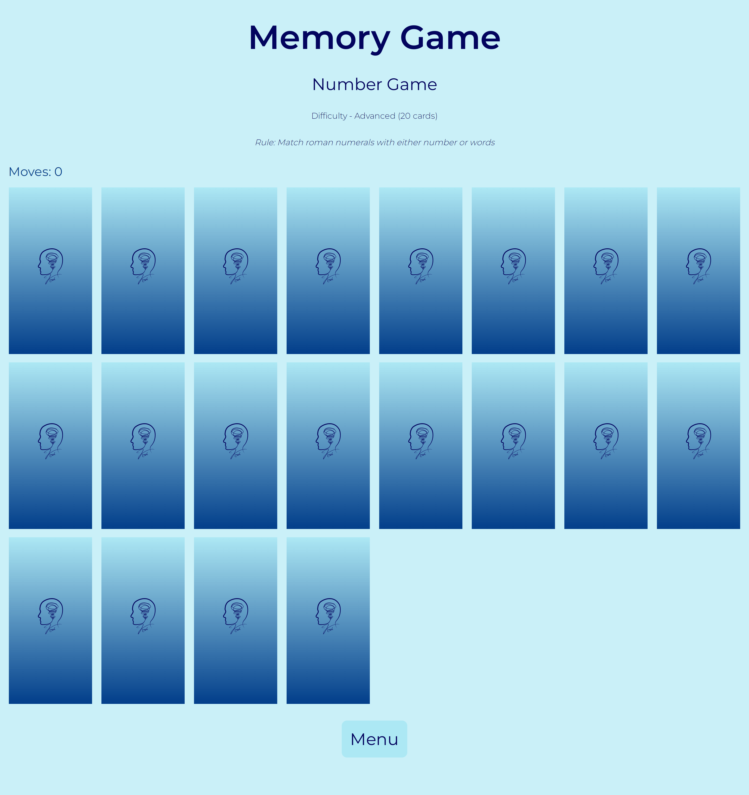
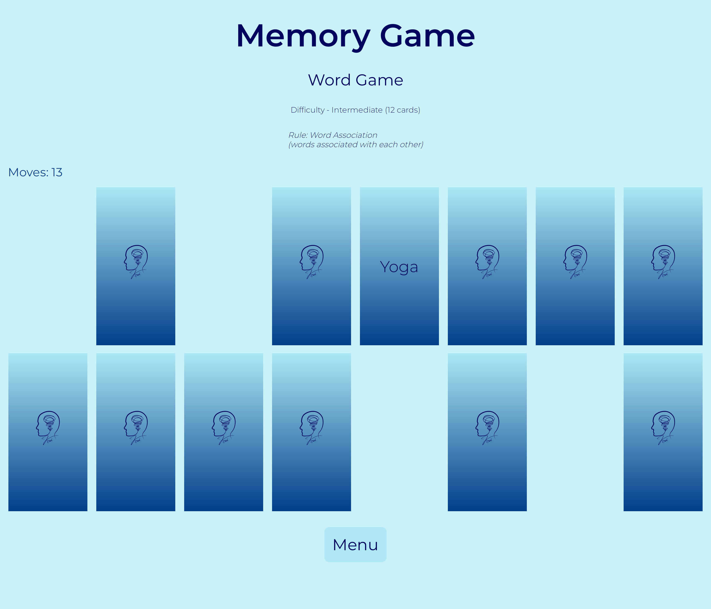
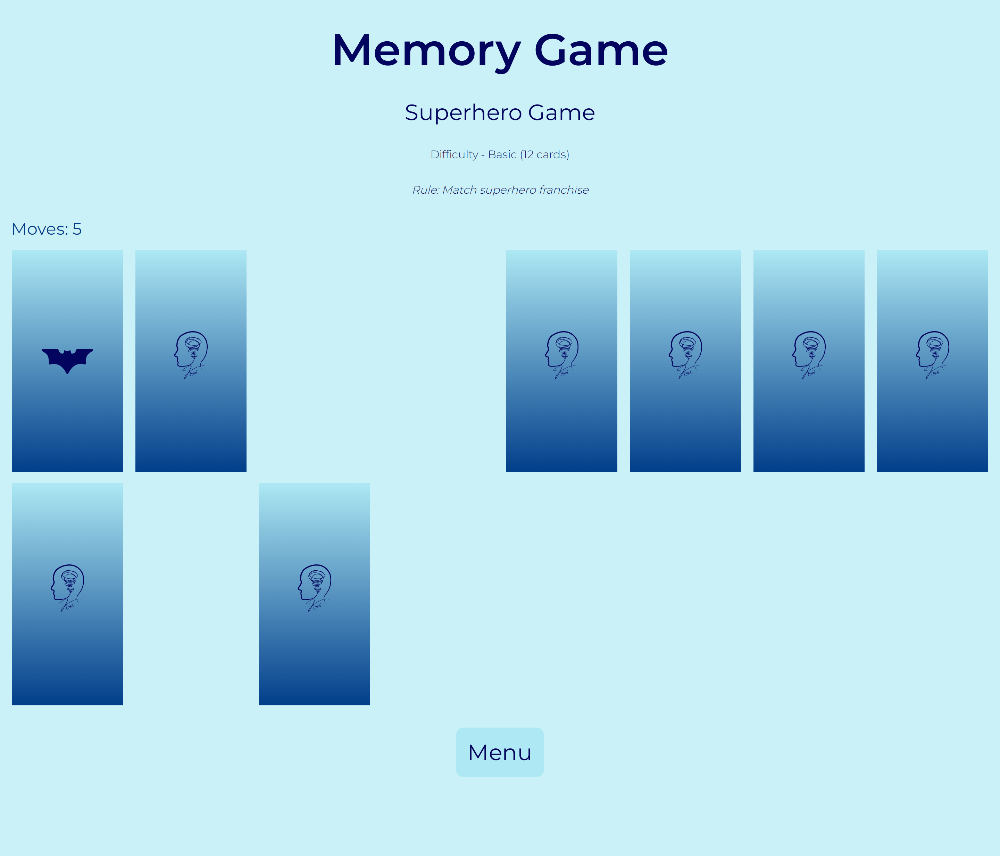

# Personal Project - Memory game

- This is a personal project undertaken to enhance and get hands-on practice with JavaScript.
- This project is a Memory game wherein player matches cards with equal or similar values to win.
- The project offers intuitive and simple user interface for the best experience.

## Table of contents

- [Overview](#overview)
  - [The challenge](#the-challenge)
  - [Screenshot](#screenshot)
  - [Links](#links)
- [My process](#my-process)
  - [Built with](#built-with)
  - [What I learned](#what-i-learned)
  - [Continued development](#continued-development)
- [Acknowledgments](#acknowledgments)

## Overview

### The challenge

Users should be able to:

- choose type of game to play (number / word / superhero)
- different difficulties have different number of cards with harder choices to make
- track number of moves while playing the game
- complete rounds to move to the next difficulty and complete game

### Screenshot

Welcome (Menu) Page - This shows the menu page wherein you can choose the type of game to play


Number Game - You match numbers to complete the game


Word Game - You match similar words to complete the game


Superhero Game - You match similar superhero franchise icons (Marvel / DC) to complete the game


### Links

- Solution URL: [Repository link](https://github.com/kushagarwal11ag/memory)
- Live Site URL: [Website link](https://kushagarwal11ag.github.io/memory)

## My process

### Built with

- Semantic HTML5 markup
- CSS custom properties
- Flex-box
- Grid-layout
- Mobile-first workflow
- JavaScript DOM Manipulation

### What I learned

- Better understanding of JavaScript, its event listeners, DOM Manipulation, setTimeout function, etc.
- Code optimization and better efficiency.

In CSS, learned to animate card flip and when flipped, hides current information and displays new information.
```css
.flipper {
	position: relative;
	width: 100%;
	height: 100%;
	transform-style: preserve-3d;
	transition: transform 1s;
}

.front {
	z-index: 2;
	transform: rotateY(0deg);
}
```

In JavaScript, learned to implement more complex DOM manipulation. 
```js
function flipCard(event) {
	movesElement.item(currentDifficultyLevel - 1).innerHTML = `Moves: ${movesPlayed}`;		//update moves when card flipped

	if (!buttonFront && cardsRevealed < 2) {
		button.setAttribute("data-front", "true");
		button.classList.add("flipped");													//flip card
		flippedElements.push(button);

		if (cardsRevealed === 2) {
			cards.forEach((button) => {
				button.removeEventListener("click", flipCard);
			});
			if (firstCardValue === secondCardValue) {										//if card values match
				setTimeout(() => {
					flippedElements[0].disabled = true;
					flippedElements[1].disabled = true;
					flippedElements = [];
				}, 1000);																	//hide cards and clear flippedElements array
			}
			//additional code
		}
	}
}
```

### Continued development

- This project could be improved further by adding more levels and games (math operations, shape or image matching, etc.)
- It would be better to focus on writing more compact and efficient code.
- Better styling and DOM manipulation could be the target of focus in further projects.

## Acknowledgments

Credits to [Ania Kubow](https://www.youtube.com/@AniaKubow) for inspiring me to undertake this simple project to better my JavaScript skills.
